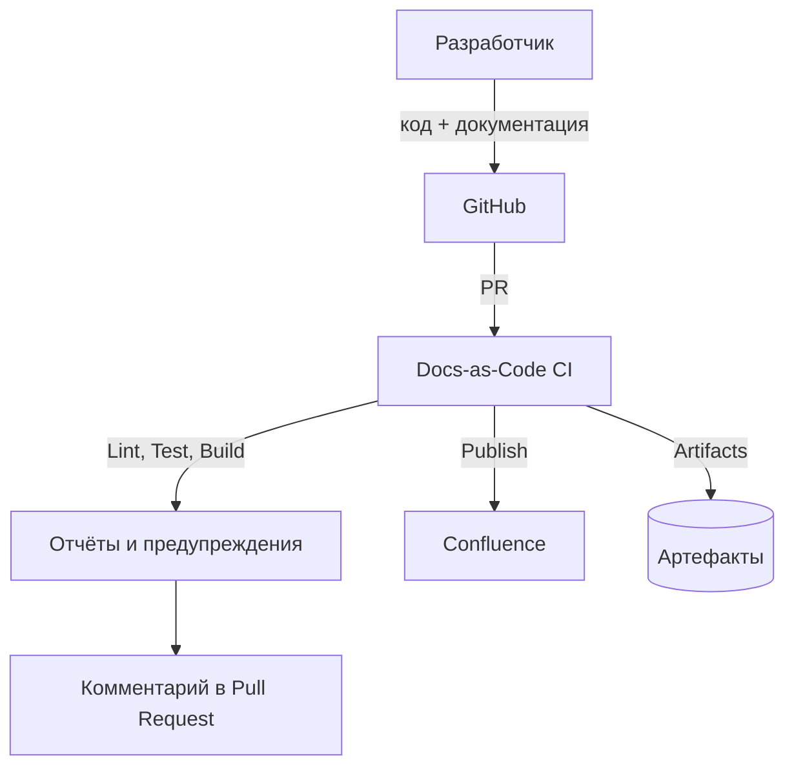
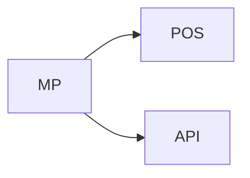

# 🧱 Docs-as-Code: Архитектура и процессы

*Интеграция документации, кода и аналитических артефактов в единую CI/CD-платформу.*

---

## 🧩 1. Цели и принципы

| Цель                      | Описание                                                                    |
| ------------------------- | --------------------------------------------------------------------------- |
| 📘 Единый источник правды | Документация хранится рядом с кодом, синхронно развивается и релизится.     |
| ⚙️ Автоматизация CI/CD    | Проверки, форматирование, публикация в Confluence — без ручных шагов.       |
| 🧾 Прозрачность истории   | Каждое изменение в ТЗ фиксируется коммитом с причиной.                      |
| 🔗 Связность              | Документы разных проектов связаны зависимостями и визуализируются как граф. |

---

## ⚙️ 2. Архитектура Docs-as-Code

### Общая схема



---

## 🧰 3. Техническая инфраструктура

### 3.1. Основные компоненты

| Компонент                   | Назначение                                           | Пример инструмента                                |
| --------------------------- | ---------------------------------------------------- | ------------------------------------------------- |
| **Хранилище документации**  | GitHub / GitLab (папка `/docs`)                      | Git                                               |
| **CI/CD pipeline**          | Автоматические проверки и публикации                 | GitHub Actions / GitLab CI                        |
| **Линтеры и форматеры**     | Проверка Markdown, AsciiDoc, OpenAPI, стиля          | `markdownlint`, `asciidoctor`, `spectral`, `vale` |
| **Среда контейнеризации**   | Единая среда с зависимостями                         | Docker                                            |
| **Публикация в Confluence** | Автоматический экспорт                               | `doctoolchain`, REST API Atlassian                |
| **AI-помощник**             | Автоматическое резюмирование, проверка читабельности | ChatGPT / LLM API                                 |

---

## 🧱 4. Docker-инфраструктура

Docker-образ `docs-cli:ci` включает все утилиты для локальных и CI-проверок:

| Категория | Инструменты                                     |
| --------- | ----------------------------------------------- |
| Markdown  | `markdownlint-cli2`, `mdformat`                 |
| AsciiDoc  | `asciidoctor`, `asciidoctor-doctest`, `rubocop` |
| OpenAPI   | `@stoplight/spectral-cli`                       |
| Стиль     | `Vale`                                          |
| Python    | `mdformat`, скрипты для графов и отчётов        |

Пример запуска локально:

```bash
docker run --rm -it -v "$(pwd):/work" -w /work docs-cli:ci bash
./scripts/run-linters.sh
```

---

## 🔍 5. CI/CD pipeline (docs-ci.yml)

### Основные этапы:

| Этап                  | Назначение                          | Пример                                   |
| --------------------- | ----------------------------------- | ---------------------------------------- |
| **Markdown linting**  | Проверка стиля и структуры Markdown | `markdownlint-cli2`                      |
| **AsciiDoctor тесты** | Проверка AsciiDoc-файлов и шаблонов | `asciidoctor-doctest`                    |
| **OpenAPI валидация** | Проверка спецификаций API           | `spectral lint`                          |
| **Vale**              | Проверка грамматики и терминологии  | `vale`                                   |
| **PR Comment**        | Автоматический отчёт в Pull Request | `marocchino/sticky-pull-request-comment` |

Пример запуска в CI:

```yaml
- name: 🧩 Run Docs-as-Code validation (Soft Mode)
  run: |
    docker run --rm -v "$PWD":/work -w /work docs-cli:ci \
      bash ./scripts/run-linters.sh
```

---

## 📊 6. Структура проверок и логов

Все логи сохраняются в `artifacts/` и прикладываются к PR:

| Файл                         | Назначение                    |
| ---------------------------- | ----------------------------- |
| `artifacts/markdownlint.log` | Проверка Markdown             |
| `artifacts/asciidoc.log`     | Проверка AsciiDoc             |
| `artifacts/openapi.log`      | Проверка OpenAPI              |
| `artifacts/vale.log`         | Проверка стиля и терминологии |

💡 *CI автоматически публикует предупреждения в виде комментариев PR (soft mode).*

---

## 🧾 7. Интеграция с Confluence

### Поддерживаемые форматы:

| Формат                       | Метод публикации                     |
| ---------------------------- | ------------------------------------ |
| AsciiDoc                     | `doctoolchain publishToConfluence`   |
| Markdown                     | `pandoc` → HTML → API Confluence     |
| HTML                         | Прямой экспорт через REST API        |
| Diagrams (PlantUML, Mermaid) | Автоматический рендер при публикации |

### Пример пайплайна:

```bash
doctoolchain . publishToConfluence \
  -Pconfluence.space=DOCS \
  -Pconfluence.parentId=123456 \
  -Pconfluence.credentials=env:CONF_TOKEN
```

---

## 📐 8. Диаграммы и визуализация

| Тип диаграммы       | Язык                           | Поддержка |
| ------------------- | ------------------------------ | --------- |
| UML                 | PlantUML                       | ✅         |
| Графы зависимостей  | Mermaid, D2, Graphviz          | ✅         |
| Архитектурные схемы | AsciiDoctor Diagram / Kroki.io | ✅         |

Пример:

```adoc
[plantuml, diagram-auth, svg]
----
@startuml
actor User
User -> System : Отправляет запрос
System --> User : Возвращает ответ
@enduml
----
```

---

## 🧮 9. Шаблоны и генераторы документов

| Тип шаблона        | Инструмент         | Формат         |
| ------------------ | ------------------ | -------------- |
| ТЗ, API Spec       | AsciiDoc templates | `.adoc`        |
| Руководства        | Markdown templates | `.md`          |
| Технические отчёты | Jinja2 + Python    | `.adoc`, `.md` |

📘 Рекомендация:
→ Хранить шаблоны в `/templates` и генерировать из них новые ТЗ через CLI:

```bash
python scripts/new_doc.py --template api_spec.adoc --name pos-order
```

---

## 🤖 10. Интеграция ИИ

| Возможность           | Пример применения                                     |
| --------------------- | ----------------------------------------------------- |
| Рефакторинг текста    | “Приведи текст ТЗ к корпоративному стилю”             |
| Проверка соответствия | “Проверь, что API документация соответствует Swagger” |
| Автогенерация TL;DR   | “Создай краткое описание изменений”                   |
| Семантический поиск   | “Найди все ТЗ, где упоминается POS”                   |

📘 *Интеграция:*
LLM API (например, OpenAI, Anthropic) можно подключить через Python CLI, анализируя `.md` и `.adoc` файлы перед публикацией.

---

## 🔗 11. Графы зависимостей между ТЗ

**Задача:** при изменении одного ТЗ подсвечивать связанные документы.

### Реализация:

1. В каждом документе — frontmatter:

```yaml
---
project: MP
depends_on:
  - POS
  - API
---
```

2. Скрипт анализирует зависимости:

```bash
python scripts/build_graph.py --format mermaid --output artifacts/deps.md
```

3. Результат сохраняется в CI как граф:



---

## 🧩 12. Процесс ревью и управления изменениями

| Этап               | Ответственный          | Описание                             |
| ------------------ | ---------------------- | ------------------------------------ |
| **Создание ветки** | Аналитик               | `feature/PROJECT-123`                |
| **Написание ТЗ**   | Аналитик / Разработчик | Добавляет `.md` / `.adoc`            |
| **Ревью**          | Команда                | Комментирует через PR                |
| **Мёрж**           | Тимлид / СА            | Проверка и одобрение                 |
| **Публикация**     | CI                     | Автоматическая выгрузка в Confluence |

---

## 🗂️ 13. Именование файлов, ТЗ и каталогов

| Элемент           | Рекомендации                                                 |
| ----------------- | ------------------------------------------------------- |
| **Имена файлов и папо**  | Только латиница (a-z, 0-9, -, _)                       |
| **Пробелы** | - (kebab-case)              |
| **Язык имён**          | Английский (например, order-processing.adoc)            |
| **Заголовки внутри файлов**        | Можно по-русски — они отображаются пользователю |

---

## 🧾 14. Формат коммитов и веток

| Элемент           | Правило                                                 |
| ----------------- | ------------------------------------------------------- |
| **Формат ветки**  | `feature/PROJECT-123-description`                       |
| **Типы коммитов** | `feat`, `fix`, `docs`, `chore`, `refactor`              |
| **Язык**          | Можно по-русски, но единый формат обязателен            |
| **Пример**        | `feat(docs): обновлено ТЗ по API заказов (PROJECT-123)` |

---

## 🚀 15. Контроль релизов документации

| Подход                | Описание                                              |
| --------------------- | ----------------------------------------------------- |
| **Git-теги**          | `release-2025.01` → публикуется в Confluence PROD     |
| **Ветки окружений**   | `develop` → sandbox / `main` → production             |
| **Confluence Spaces** | Отдельные “рабочие” и “производственные” пространства |

---

## 🧭 16. Управление доступом и ревью

| Инструмент                | Назначение                                  |
| ------------------------- | ------------------------------------------- |
| `CODEOWNERS`              | Назначение ответственных за разделы         |
| `Pull Request Template`   | Шаблон с чек-листом ревью                   |
| `Labels`                  | Быстрая категоризация PR (docs, api, style) |
| `Branch protection rules` | Запрещает merge без ревью документации      |

---

## 📌 Заключение

Docs-as-Code позволяет превратить документацию из пассивного архива в **живой, версионируемый и интегрированный артефакт разработки**, доступный через CI/CD, AI и Confluence.
В этом подходе аналитики и разработчики работают синхронно, а качество и актуальность документации обеспечиваются теми же DevOps-практиками, что и для кода.


